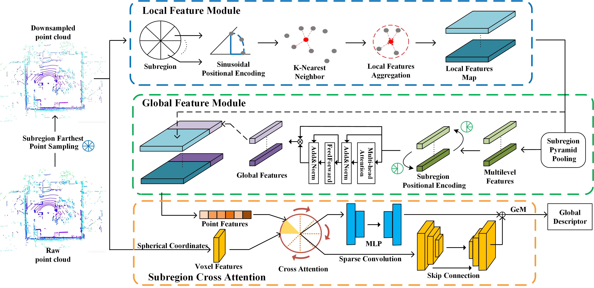

# 📍 DRIR-Net: Dual-Branch Rotation Invariant and Robust Network for 3D Place Recognition

> A robust and rotation-equivariant approach for place recognition in large-scale 3D environments.  

---

## 🌟 Highlights

- ✅ A subregion downsampling method reduces preprocessing time for point clouds
- ✅ The extraction of noise-resistant point features and rotation-invariant descriptors
- ✅ Subregion cross attention fuses point and voxel features with accurate correspondence
- ✅ Superior performance and generalization on multiple 3D place recognition datasets

---

## 🏗️ Architecture Overview



---

## 🔧 Setup

This section is under construction.

```bash
git clone https://github.com/IATBOMSW/DRIR-Net.git
cd DRIR-Net
```

---

## 🚀 Getting Started

This section is under construction.


### Evaluation

```bash
python eval.py --ckpt checkpoints/model_best.pth

```

---


## 📄 Citation

This section is under construction.

---

## 🙏 Acknowledgements

We are thankful for the remarkable work of [MinkLoc3D-SI](https://github.com/KamilZywanowski/MinkLoc3D-SI), [CASSPR](https://github.com/Yan-Xia/CASSPR), and the  community, which inspired this research.

---

## 📬 Contact

This section is under construction.

```
